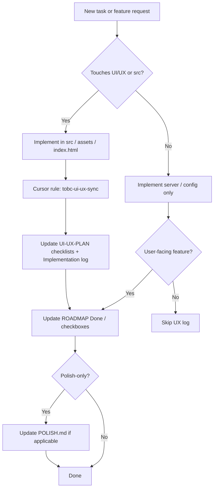
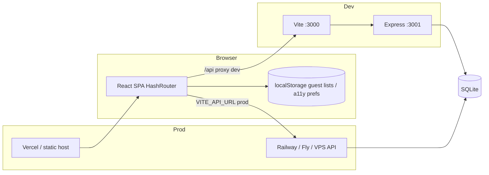
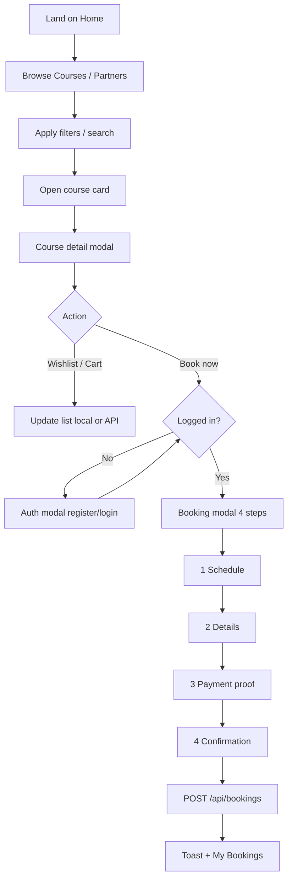
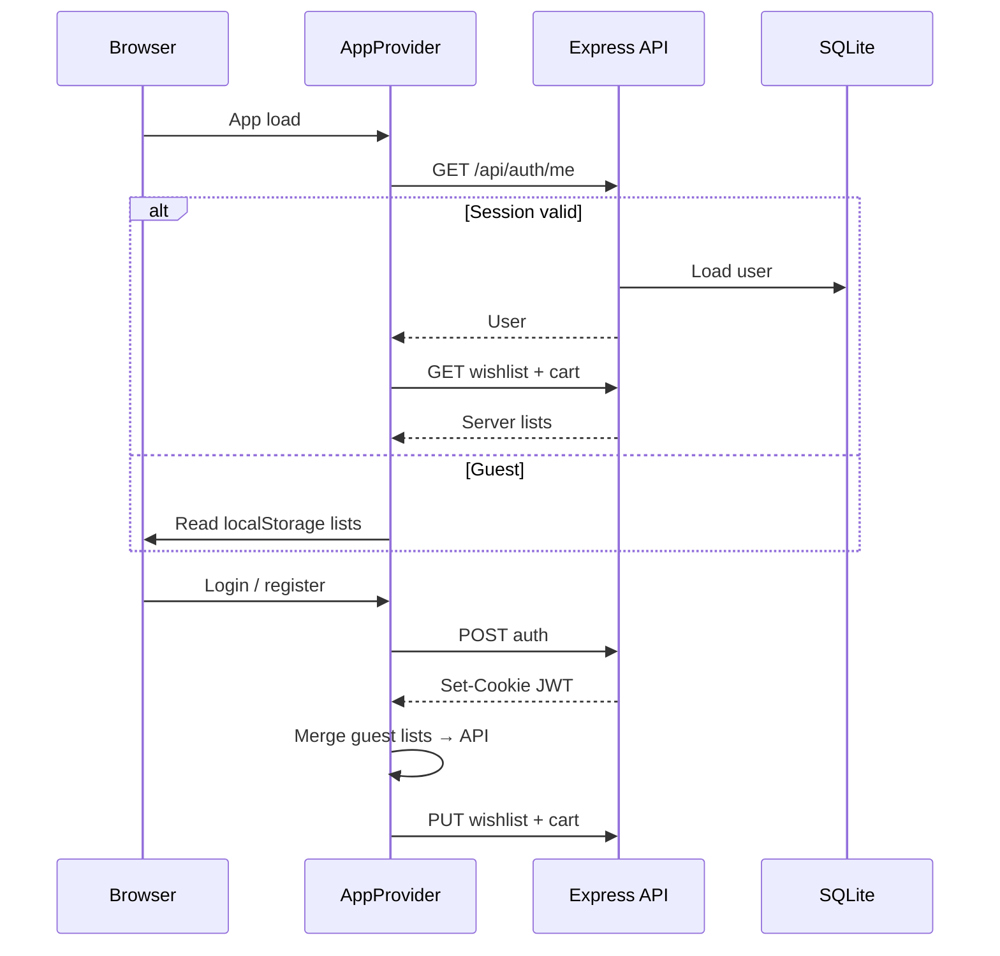
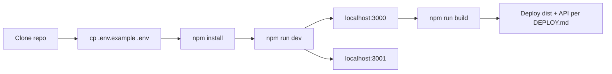

# TOBC — Project documentation

**The Online Booking Corp** — maritime training marketplace MVP.

This document explains what was built from the first site rework through the React migration and backend, how ongoing work stays documented in sync, and how the codebase is organized.

**Related living docs:** [UI-UX-PLAN.md](./UI-UX-PLAN.md) · [ROADMAP.md](./ROADMAP.md) · [POLISH.md](./POLISH.md) · [DEPLOY.md](./DEPLOY.md) · [README.md](../README.md)

---

## 1. Executive summary

TOBC is a single-page application where seafarers and training providers browse accredited courses, filter partners, book training, and manage wishlists, carts, and bookings. The product started as a static HTML/CSS/JS prototype, gained UX polish and hash routing, then was **migrated to React 19 + TypeScript + Vite** with a **small Express + SQLite API** for real accounts, bookings, lists, profile, and chat persistence.

Work is delivered in **phases** (routing → visual system → polish → React migration → backend features). **Documentation stays in sync** through a Cursor workspace rule: when UI/UX or product-facing code changes, agents update [UI-UX-PLAN.md](./UI-UX-PLAN.md) and, for features, [ROADMAP.md](./ROADMAP.md) — not via filesystem watchers, but as an explicit habit during each task.

---

## 2. Ongoing task sync (how we keep docs current)

When new work starts or ships, three artifacts stay aligned:

| Artifact | Role | When to update |
|----------|------|----------------|
| [`.cursor/rules/tobc-ui-ux-sync.mdc`](../.cursor/rules/tobc-ui-ux-sync.mdc) | Always-on Cursor rule | Drives agent behavior automatically when `src/**`, `index.html`, or UX `public/**` are edited |
| [UI-UX-PLAN.md](./UI-UX-PLAN.md) | UI/UX source of truth | Checklist rows + **Implementation log** (dated bullets) after material UX changes |
| [ROADMAP.md](./ROADMAP.md) | Feature backlog | Check boxes, move items to **Done**, adjust tiers |

**POLISH.md** tracks pre-deploy polish phases (A–D). **This file (PROJECT.md)** is the stable overview; update it when architecture, stack, or phase summaries change materially.

### Sync workflow (process)



**Rules of thumb:**

- One **Implementation log** line per meaningful UX ship (date, summary, files) — not for typos or non-UX refactors.
- **ROADMAP** for API features, auth, bookings, deploy, chat persistence.
- **POLISH** for empty states, skeletons, toast noise, tablet targets.
- Do not duplicate every log line here; use UI-UX-PLAN for the detailed UX chronology.

---

## 3. Requirements

### 3.1 Product goals

| Goal | Description |
|------|-------------|
| Discovery | Browse and search maritime training courses; filter by category, location, accreditation, etc. |
| Trust | MARINA-accredited positioning, booking trust strip, legal modals (Terms, Privacy, Cookie, Refund, etc.) |
| Conversion | Course detail → wishlist/cart → multi-step booking with payment proof upload |
| Accounts | Register/login with email + password; session across refresh via httpOnly cookie |
| Persistence | Bookings, wishlist, and cart stored per user on server; guest lists in `localStorage` until login merge |
| Support | Live chat UI at `/messages`; persisted threads when logged in |
| Accessibility | Focus-visible styles, Escape to close overlays, `prefers-reduced-motion`, display settings panel |

### 3.2 Non-functional

| Area | Requirement |
|------|-------------|
| Dev experience | `npm run dev` runs Vite (3000) + API (3001) with `/api` proxy |
| Deploy | Static frontend (`dist/`) + separate API; CORS + `COOKIE_SAME_SITE=none` for cross-origin |
| Security | bcrypt password hashes; JWT in httpOnly cookie; Zod validation on API inputs |
| Routing | HashRouter for static hosting (`#/home`, `#/courses`, …) |
| Browser support | Modern evergreen browsers; responsive 375px–1280px+ |

### 3.3 Out of scope (deferred)

- Google Sign-In (documented in [GOOGLE-SIGNIN.md](./GOOGLE-SIGNIN.md), not wired)
- Agency / Training Center portals (toasts / “coming soon”)
- Real payment gateway (screenshot upload only)
- Production deploy execution (guide exists; operator runs smoke tests)

---

## 4. Tech stack

### 4.1 Frontend

| Tool | Version / notes |
|------|-----------------|
| React | 19 |
| TypeScript | ~5.8 |
| Vite | 6 — dev server, build, `/api` proxy |
| React Router | 7 — `HashRouter`, nested routes under `Layout` |
| Tailwind CSS | v4 via `@tailwindcss/vite` — incremental; main design system in `assets/styles/main.css` |
| Fonts / icons | Montserrat, DM Sans; Bootstrap Icons (CDN in `index.html`); Material Symbols on About puzzle |

### 4.2 Backend

| Tool | Notes |
|------|--------|
| Node.js | ESM (`"type": "module"`) |
| Express | 4 — REST API under `/api/*` |
| SQLite | `node:sqlite` (`DatabaseSync`) — `data/tobc.db` |
| bcryptjs | Password hashing |
| jsonwebtoken | Session token in httpOnly cookie |
| cookie-parser, cors | Cross-origin session support |
| zod | Request body validation |
| tsx | Run/watch TypeScript server |

### 4.3 Tooling & hosting

| Tool | Purpose |
|------|---------|
| concurrently | `npm run dev` — web + API together |
| Vercel | Frontend static deploy (`vercel.json`) |
| API host | Backend — [DEPLOY.md](./DEPLOY.md) |

### 4.4 APIs (REST)

All authenticated routes require session cookie (`credentials: 'include'`).

| Method | Path | Purpose |
|--------|------|---------|
| GET | `/api/health` | Health check |
| POST | `/api/auth/register` | Create account |
| POST | `/api/auth/login` | Sign in |
| POST | `/api/auth/logout` | Clear cookie |
| GET | `/api/auth/me` | Current user |
| GET, POST | `/api/bookings` | List / create bookings |
| GET, PUT | `/api/lists/wishlist`, `/api/lists/cart` | Per-user course lists |
| GET, PATCH, POST | `/api/profile`, `/api/profile/password` | Profile name, password change |
| GET, POST | `/api/messages/threads`, `.../messages` | Chat threads and messages |

Frontend client: `src/lib/api.ts` (`apiRequest`) plus thin modules: `authApi.ts`, `bookingsApi.ts`, `listsApi.ts`, `profileApi.ts`, `messagesApi.ts`.

### 4.5 Environment variables

| Variable | Where | Purpose |
|----------|--------|---------|
| `JWT_SECRET` | Server | Sign session tokens |
| `PORT`, `NODE_ENV` | Server | Listen port, mode |
| `CLIENT_ORIGIN` | Server | CORS allowlist |
| `COOKIE_SAME_SITE` | Server | `lax` (local) / `none` (cross-site prod) |
| `DATABASE_PATH` | Server | SQLite file path |
| `VITE_API_URL` | Frontend build | API origin in production (empty in dev → proxy) |

See [.env.example](../.env.example).

---

## 5. Architecture

### 5.1 System context



### 5.2 Frontend layers

```text
index.html
  └── src/main.tsx          HashRouter + AppProvider
        └── App.tsx         Route table → pages
        └── Layout.tsx      Chrome: header, footer, modals, MBN, drawer
        └── pages/*         Page content (Home, Courses, …)
        └── components/*    Reusable UI (CourseCard, BookingModal, AboutPuzzle)
        └── context/        AppProvider — global state, auth, booking, lists
        └── lib/            API clients, filters, routes, scroll lock
        └── data/           Static JSON/TS datasets (courses, partners, legal)
assets/styles/main.css      Primary design tokens and layout CSS
public/assets/              Images, puzzle SVGs
```

**State:** `AppProvider` centralizes role, auth, booking modal, course detail, wishlist/cart (with API sync), toasts, drawer/help/onboarding, legal and accessibility modals. Pages remain mostly presentational; filters use local state + shared data modules.

### 5.3 Backend layers

```text
server/index.ts       Express app, CORS, routes mount
server/env.ts         Load .env
server/db.ts          Schema + SQLite connection
server/routes/        auth, bookings, lists, profile, messages
server/auth/          jwt, session, password helpers
```

### 5.4 Routing

Hash-based paths (compatible with static hosts):

`#/home` · `#/courses` · `#/partners` · `#/about` · `#/news` · `#/library` · `#/wishlist` · `#/cart` · `#/messages` · `#/bookings` · `#/profile` · `#/settings`

Query params carry filters where needed (e.g. `?filter=stcw`, partner `?type=`).

---

## 6. UI/UX

### 6.1 Design system

- **Brand palette** (8 colors): Navy `#004762`, Deep Sea `#00555e`, Teal `#28a5a8`, Sky `#b9e5fb`, Orange `#FF7500`, Ochre `#fdba61`, Ivory `#fffce8` — mapped to CSS variables in `assets/styles/main.css`.
- **Typography:** Montserrat (headings), DM Sans (body).
- **Spacing tokens:** `--space-1` … `--space-6` in `:root`.
- **Primary actions:** Teal reserved for book / register / search CTAs (discipline still in progress per UI-UX-PLAN).

### 6.2 Information architecture

| Area | Behavior |
|------|----------|
| Global header | Logo, nav dropdowns (Courses, Partners, News), global search → pre-fills Courses search |
| Role quick bar | Seafarer / Training Center / Agency paths (some CTAs still demo toasts) |
| Mobile | Bottom nav (Home, Courses, Partners, More → drawer); drawer highlights current route |
| Pages | Home hero + stats; Courses sidebar filters + grid/list; Partners geo filters; About puzzle; News/Library cards |
| Overlays | Booking (4 steps), auth, legal, accessibility, onboarding (guest, per session), course detail |

### 6.3 Accessibility & feedback

- `:focus-visible` on interactive chrome; **Escape** closes overlays (`useEscapeKey` in `Layout`).
- `prefers-reduced-motion` in CSS; user override via Display & accessibility panel (`localStorage`).
- Toasts top-center; grid/list view toggle is silent (no toast noise).
- Booking trust strip under breadcrumb; breadcrumbs use `aria-current="page"` on heroes.

### 6.4 Signature UX: About puzzle

Four interlocking pieces (Platform, Mission, Story, Vision) with SVG paths, hover glow, Material Symbols icons, and modal copy from `src/data/aboutPuzzle.json`. Iterated from separate PNGs → single composite → per-piece SVGs for correct interlock alignment.

Full checklist and dated log: [UI-UX-PLAN.md](./UI-UX-PLAN.md).

---

## 7. Process flowcharts

### 7.1 User: browse to booking



### 7.2 Auth and list sync



### 7.3 Development workflow



---

## 8. Code documentation

### 8.1 Directory reference

| Path | Responsibility |
|------|----------------|
| `src/main.tsx` | React root, `HashRouter`, `AppProvider` |
| `src/App.tsx` | Route definitions |
| `src/context/AppProvider.tsx` | Global app state, auth, booking, lists sync |
| `src/components/layout/` | `SiteHeader`, `Footer`, `Layout`, `MobileDrawer`, `MobileBottomNav`, `NavDropdown`, `ProfileMenu` |
| `src/components/` | Modals, cards, puzzle, shared `EmptyResults`, `ToastStack` |
| `src/pages/` | One file per main route |
| `src/lib/` | `api.ts`, `routes.ts`, filter helpers, `scrollLock`, `accessibility`, `passwordRules` |
| `src/data/` | Mock catalog: `courses.ts`, `partners.ts`, `legalContent.ts`, `aboutPuzzle.json`, geo lists |
| `src/hooks/useEscapeKey.ts` | Stack Escape handlers for overlays |
| `server/` | API implementation |
| `assets/styles/main.css` | Legacy-compatible design system (imported from React) |
| `public/assets/` | Static images and puzzle SVGs |
| `data/tobc.db` | SQLite (gitignored, created on first API run) |

### 8.2 Key modules

**`AppProvider.tsx`** — Exposes `useApp()`:

- Auth: `loginWithEmail`, `registerWithEmail`, `logout`, `authSessionReady`, `openAuthModal`
- Navigation: `navigateTo(page)`
- Commerce: `openBooking`, `startBookNow`, wishlist/cart mutators, `syncListsForUser` on session restore/login
- UI chrome: drawer, help, onboarding, toasts, legal/accessibility modals

**`apiRequest` (`src/lib/api.ts`)** — Unified `fetch` with `credentials: 'include'` and typed success/error union.

**`server/db.ts`** — Creates tables: `users`, `bookings`, `user_course_lists`, `chat_threads`, `chat_messages`.

**`BookingModal.tsx`** — Four-step wizard; submits to `createBooking` when logged in.

**`CourseCard.tsx`** — List/grid card with ratings, description link, wishlist/cart actions.

### 8.3 Types

Central types in `src/types/index.ts`: `PageId`, `RoleId`, `AuthUser`, `BookingState`, `ToastItem`, `LegalDoc`, etc.

### 8.4 Scripts

| Command | Effect |
|---------|--------|
| `npm run dev` | Vite + API watch (concurrently) |
| `npm run dev:web` | Frontend only |
| `npm run dev:api` / `dev:api:watch` | API only |
| `npm run build` | `tsc --noEmit` + Vite production build |
| `npm run start:api` | Production API start |

---

## 9. Summary of phases

### 9.1 Historical timeline (high level)

| Phase | Period (log) | What shipped |
|-------|----------------|--------------|
| **0 — Static rework** | Early commits | Landing/site rework; Vercel root deploy |
| **1 — Legacy SPA UX** | 2026-05-11 | Hash routing in `tobc.js`, mobile nav parity, Escape/focus/reduced-motion, Bootstrap Icons, booking trust strip |
| **2 — Content & puzzle** | 2026-05-18–19 | Onboarding overlay fix; About interactive puzzle (multiple art iterations) |
| **3 — React migration** | 2026-05-19 | Vite + React + TS + Tailwind; HashRouter; layout chrome; six core pages |
| **4 — Product depth** | 2026-05-19 | Courses/Partners filters; course detail; booking flow; cart/wishlist pages |
| **5 — Backend** | 2026-05-19 | Express + SQLite auth; bookings, lists, profile, messages APIs |
| **6 — Polish & accounts** | 2026-05-19+ | Legal modals, accessibility panel, profile menu, messages page, scroll fixes, Phase C polish |
| **7 — Current** | Ongoing | Deploy docs; roadmap Tier 1–2 largely done; Tier 3 polish (skeletons, empty states) partial |

Git milestones: `313b89e` site rework → `e12b453` React/Vite migration → `abb37d8` persisted bookings and profile flows.

### 9.2 UI-UX phased delivery (from UI-UX-PLAN)

| Phase | Focus |
|-------|--------|
| **Phase 0** | Routing/history; search IA; mobile nav parity |
| **Phase 1** | Design tokens; inline → CSS; focus + reduced motion |
| **Phase 2** | Icons (done), skeletons, empty states, microcopy |

### 9.3 Polish phases (from POLISH.md)

| Phase | Focus | Status |
|-------|--------|--------|
| **A** | Empty states, skeletons, toast noise, hero CTAs | Open |
| **B** | Touch targets, tablet filters, drawer CSS | Open |
| **C** | Shared empty states, booking price strip, legal modals, a11y panel | **Done** |
| **D** | Unread badge, certificates placeholder, portal pages | Open |

### 9.4 Roadmap tiers (from ROADMAP.md)

| Tier | Focus | Status |
|------|--------|--------|
| **1 — Core** | Bookings API, lists API, production auth config | Implemented; live deploy is operator step |
| **2 — Logged-in** | Profile, settings, mobile drawer, chat persistence | Implemented |
| **3 — Polish** | Skeletons, tablet UX, CSS cleanup | Partial |
| **4 — Later** | Google Sign-In, portals, certificates | Backlog |

---

## 10. What to read next

| Question | Document |
|----------|----------|
| What UX item is done or next? | [UI-UX-PLAN.md](./UI-UX-PLAN.md) |
| What feature to build next? | [ROADMAP.md](./ROADMAP.md) |
| Pre-launch polish checklist? | [POLISH.md](./POLISH.md) |
| How to deploy? | [DEPLOY.md](./DEPLOY.md) |
| How to run locally? | [README.md](../README.md) |

---

## 11. Maintenance

When you change **architecture**, **stack**, or **phase summaries**, update this file and link it from the README.

When you ship **UI-visible** work, append to **UI-UX-PLAN → Implementation log** (required by Cursor rule).

When you ship **features**, update **ROADMAP → Done**.

*Last comprehensive review: 2026-05-20.*
